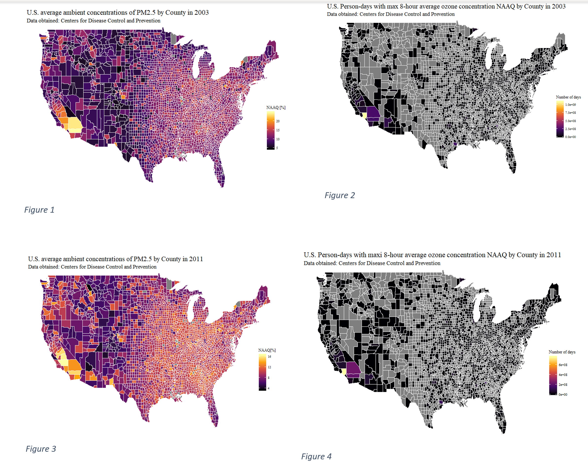
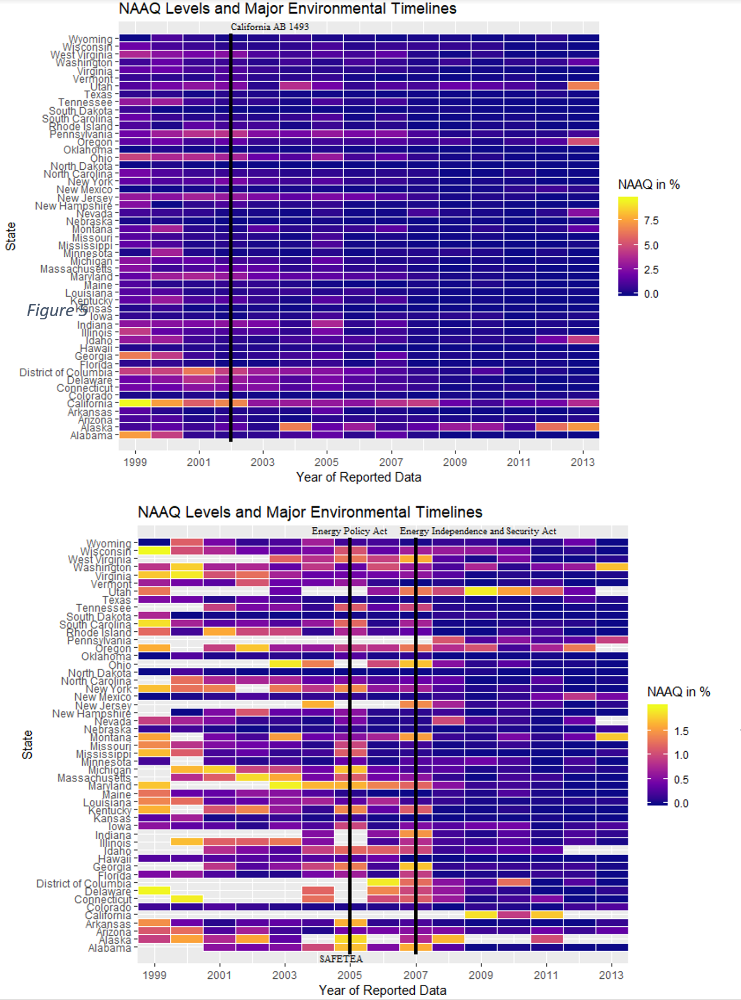
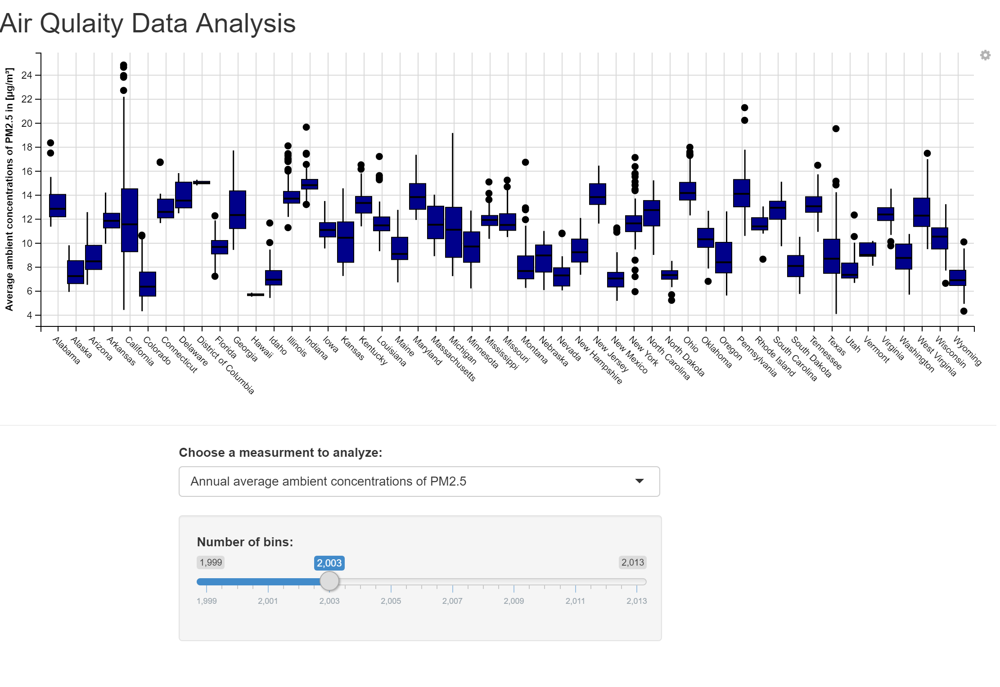

# Air-Quality-Data-Analysis
<h1 align="center">
   
  
   
  Damini K Rijhwani
   
</h1>

<h4 align="center"> Air Quality Data Analysis from <a href="https://data.cdc.gov/Environmental-Health-Toxicology/Air-Quality-Measures-on-the-National-Environmental/cjae-szjv">Centers for Disease Control and Prevention</a>.</h4>

  
  
  
  

   <a href="#key-features">Key Features</a> •
  <a href="#intro">Intro</a> •
  <a href="#Approach-to-Problem">Approach to Problem</a> •
  <a href="#Tasks-Accomplished">Tasks Accomplished</a> •
  <a href="#download">Download</a>

## Key Features 

Interactive plots for separate years of analysis 
Spatial Heatmaps 
Heatmaps with timeline to uncover changes in data to environmental acts passed during certain years 

## Intro 

The motivation of this project stems from the rapid changes in climate change due to the underlying 
cause of emissions of pollutants in the atmosphere. The ecological changes faced in the recent decades 
and the health problems that affect all demographics are largely contributed to the change in air quality. 
The quality of air is a symptom from exploited natural resources such as combusting fossil fuels, deasil 
emissions and secondary partial formations.  Analysis should therefore focus on the quality of air to 
estimate the origins and patterns of harmful emissions.

## Approach to Problem

My approach to solving this problem was to gather appropriate dataset
 that represent all states and counties within US.  The dataset contains annual information on the average 2.5
  PM for counties and also the exceeded levels of NAAQs permitted levels of gas emissions for 
  several gases qualified as pollutants.  2.5 PM is the particulate matter that have a diameter
   of less than 2.5 micrometers. 
 

 

Three graphs for visualization which have several versions of the graph for different 
controlled variable, such as year, and state are generated to analyze affects of air quality.  
The first graph is a spatial heatmap of the United States. The dataset has particulate matter (PM2.5) 
and National Ambient Quality Standards information  per county for all states. So a visual representation 
of density of air quality measures based on geolocation was a useful graph. The second graph is a timeline heatmap representing the adverse of the amount of days NAAQ 
standards were exceeded for all states. The third plot is an interactive plot used to showcase the changes for three diferent evaluation of air quality.  

1- The number of days with 8-hour average ozone concentrations over the NAAQ standards  
2- The % of days with PM2.5 levels over the NAAQS  
3- Annual Average ambient concentration of PM2.5  

Complete analysis is provided in github repo.

## Tasks Accomplished

1.	I was able to generate spatial maps to show locations where air quality was more affected.
2.	I was able to generate a heat map to show the change in air quality factors with progression of years. 
3.	I was able to create a simple interactive tool to analyze a few of the measurements. 
4.	I was unable to add more features to the interactive tool to further narrow options and give more results. 

## Download 
Clone the github repo including source. 

---
> LinkedIn [Damini K Rijhwani](https://www.linkedin.com/in/drijhwan) 
> GitHub [@DaminiR](https://github.com/daminiR/)  
> AI Blog  [Disrupt Culture](https://thedisruptculture.com/)  

